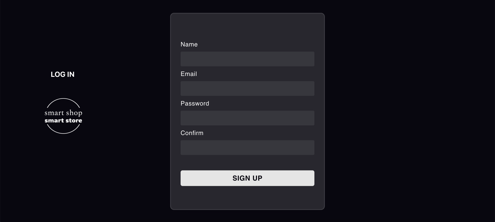
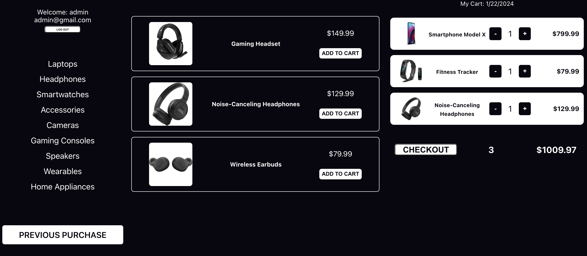
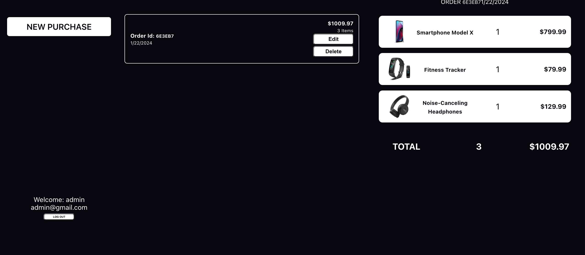

# FullStack Shop Smart

shopping experience on a real e-commerce website. The app boasts a range of functionalities, allowing users to seamlessly browse and shop for various items organized into categories. Within each category, a curated list of items is available for users to explore, with the added convenience of adding selected items to a virtual shopping cart.

The shopping cart functionality further enriches the user experience by enabling the addition or removal of items. Each set of items within the cart is considered an order, providing users with the flexibility to review their selections before proceeding to the checkout process. At the checkout stage, users can finalize their order and proceed with the payment, ensuring a streamlined and efficient shopping experience."

## Table of Contents

- [Note](#Note)
- [Introduction](#introduction)
- [Features](#features)
- [Project Structure](#project-structure)
- [Installation](#installation)
- [Technologies Used](#technologies-used)
- [Documentation](#documentation)

## Note
Note: This project is part of a comprehensive training cohort website. All images and concepts utilized are unrelated to any specific organization or advertising service. The selection of images was driven by the sole purpose of enhancing the user interface (UI) of the project, with no intention of promoting or endorsing any particular company 
or commercial entity.

## Introduction

This project is crafted to highlight details about diverse product offerings within the realm of e-commerce. It encompasses information on various categories such as products, brands, and manufacturers, featuring an array of models and options. The platform is built using a variety of technologies, incorporating routes and hooks for optimal functionality. Underscoring their significance in enhancing the overall performance and user experience of the e-commerce website.

## Layout
### Screenshots
Include screenshots of different sections or pages of your project.

## Features

- **User Authentication**: Ensure a personalized experience with secure user authentication, allowing users to customize their interactions with the platform.

- **List Items**: diffents items to shop from different electronics category 

- **Order History**: delete or edit order by modifying the number of items in the carts.

## Project Structure

The application is structured into distinct sections, making it easy to navigate and contribute:

- **src/pages/purchases**: Components for displaying and filtering the list of aviation professionals.
- **src/pages/history**: Displaying the different order been checked with time and date.
- **src/pages/Airlines**: Components related to airlines data.
- **src/models/api**: functionality for CRUD.
- **src/routes/api**: routes from the backend to fontend for different elements in the app.
- **src/config**: connect the database and different schema to mongodb.
- **src/utilities**: help the concept of using auth and different routes between the server and the front end .
- **src/components**: use different components to have an according between the elements 
- **server**: responsible about the data and the routing in the backend.

## Technologies Used
- React
- [React Router](https://reactrouter.com/) for navigation
- React Hooks (useState, useReducer, useContext, etc.)
- CSS
- HTML
- VSCODE
- Local Storage
- Express.js
- Mongodb
- api routers
- api models 

## Installation
-npx create-react-app
-npx nodemon server
-npm start 
